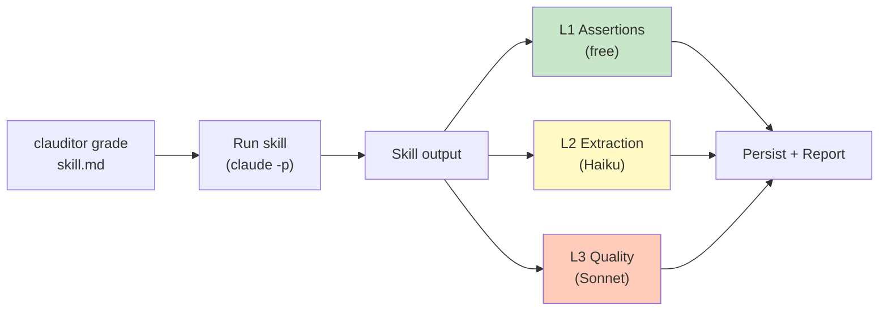
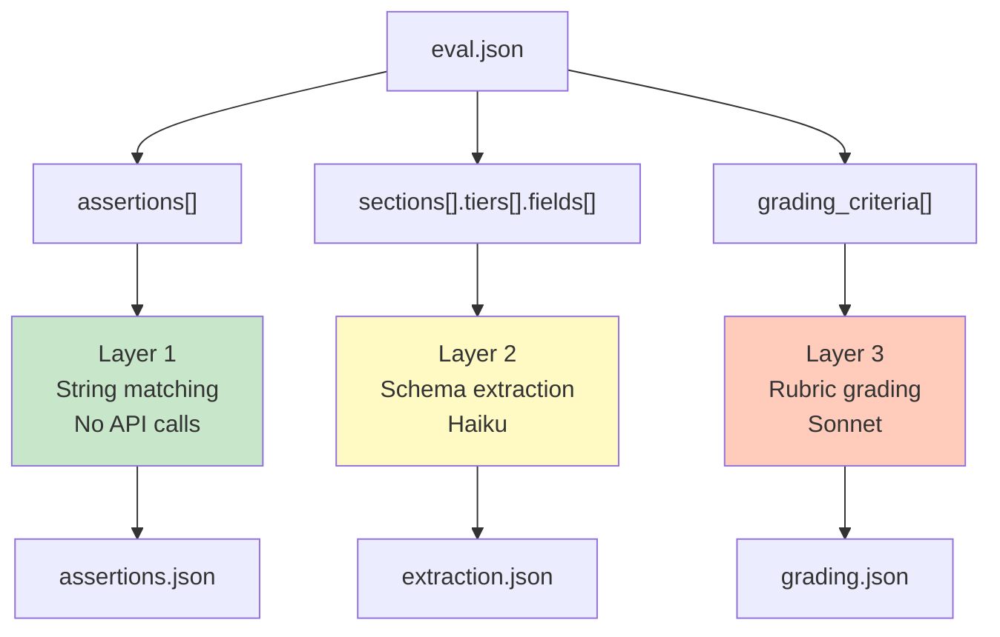

# clauditor

<p align="center">
  
</p>

[](https://github.com/wjduenow/clauditor/actions/workflows/ci.yml)
[](https://pypi.org/project/clauditor/)
[](https://pypi.org/project/clauditor/)
[](https://github.com/wjduenow/clauditor/blob/dev/LICENSE)
[](https://codecov.io/gh/wjduenow/clauditor)

Auditor for Claude Code skills and slash commands. Validates structured output against schemas using layered evaluation — deterministic assertions, LLM-graded extraction, and quality regression testing. Catches when your skill produces the wrong shape, not just the wrong answer.

When you build a skill — like a slash command that finds restaurants or generates reports — you need to know it keeps working correctly after every change. clauditor answers three questions at different cost/confidence levels:

**"Does it have the right shape?"** (Layer 1 — free, instant)
Did the output include URLs? At least 5 results? The word "Venues"? No error messages? These are deterministic checks that run in milliseconds with no API costs. Good for CI on every commit.

**"Did it extract the right fields?"** (Layer 2 — pennies, ~1 second)
Uses a cheap, fast model (Haiku) to read the output and check: does each venue have a name, address, and phone number? Are there at least 3 entries in each section? Catches structural problems that string matching can't.

**"Is the answer actually good?"** (Layer 3 — dollars, release-gating)
Uses a stronger model (Sonnet) to grade output against a rubric you write: "Are venues within the specified distance? Are events on the right date?" Also does A/B testing (is the skill better than raw Claude?), variance measurement (does it give consistent results across runs?), and trigger precision testing (does the right query activate the right skill?).

You ship AI features faster because you catch regressions automatically instead of manually spot-checking output. Layer 1 runs in CI on every push for free. Layer 3 runs before releases to catch quality problems that would otherwise reach users. The layered approach means you're not burning API dollars on every commit — just on the checks that need intelligence.

## Alignment with agentskills.io

clauditor implements (and in places extends) the skill evaluation workflow described at [agentskills.io/skill-creation/evaluating-skills](https://agentskills.io/skill-creation/evaluating-skills). If you're coming from that spec, this table maps the concepts to clauditor terminology:

| agentskills.io concept | clauditor |
|---|---|
| Test case (prompt + expected + files) | `.eval.json` with `test_args`, `input_files`, `sections`, `fields`, `grading_criteria` |
| Deterministic assertions | **Layer 1** — `assertions.py`, `FORMAT_REGISTRY` (20 canonical types), strict/extract invariants |
| LLM-judged structural checks | **Layer 2** — `grader.py`, tiered schema extraction with per-tier field requirements |
| Rubric quality grading | **Layer 3** — `quality_grader.py`, per-criterion scoring + variance measurement |
| With-skill vs without-skill baseline | `compare_ab()` Python API (`clauditor.comparator`) |
| Regression diff between runs | `clauditor compare <before> <after>` |
| Timing + token capture | `SkillResult.input_tokens/output_tokens/duration_seconds`, persisted to `history.jsonl` and `.clauditor/iteration-N/<skill>/grading.json` under nested bucket keys (`skill`, `grader`, `quality`, `triggers`, `total`) |
| Longitudinal history | `.clauditor/history.jsonl` + `clauditor trend --metric <dotted.path>` with ASCII sparklines |
| Per-iteration workspace | `.clauditor/iteration-N/<skill>/` with `grading.json`, `timing.json`, and `run-*/output.{txt,jsonl}` captures |

**Beyond the spec**, clauditor adds: trigger precision testing (`triggers.py`), a strict/extract `FORMAT_REGISTRY` invariant for canonical types, tiered section extraction (top-3 restaurants require more fields than the next 7), a reusable pytest plugin, an `AssertionResult.kind` enum for programmatic filtering, `input_files` staging into per-run CWDs, a blind A/B judge with position-swap debiasing (`clauditor compare --blind`), automated with/without baseline pair runs (`clauditor.comparator.compare_ab`), always-pass assertion auditing, execution-transcript capture for root-cause analysis, and an LLM-driven skill improvement proposer (`clauditor suggest`).

**Deliberately out of scope**: human-in-the-loop feedback capture (`feedback.json`). clauditor is pure automation — it surfaces regressions and proposes edits, but the final skill-improvement loop is author-driven.

## Install

```bash
pip install clauditor

# With LLM grading support (Layers 2 & 3):
pip install clauditor[grader]
```

Or install from source:

```bash
git clone https://github.com/wjduenow/clauditor.git
cd clauditor
uv sync --dev
```

## Installing the /clauditor slash command

clauditor ships a bundled Claude Code skill that exposes its
capture/validate/grade workflow as a `/clauditor` slash command. After
installing the CLI (pip/uv), run one command from your project root:

```bash
uv run clauditor setup
```

Expected output:

```
Installed /clauditor: <project root>/.claude/skills/clauditor -> <site-packages path>/clauditor/skills/clauditor
```

`setup` creates a single symlink at `.claude/skills/clauditor` pointing
at the bundled skill directory inside the installed clauditor package,
so `pip install --upgrade clauditor` picks up skill updates automatically
without re-running `setup`.

**Flags:**

- `--unlink` — remove the `/clauditor` symlink. Refuses to delete regular
  files or symlinks that don't point at the installed clauditor package,
  so it won't touch user-authored skills.
- `--force` — overwrite an existing file or symlink at
  `.claude/skills/clauditor`. Without `--force`, `setup` refuses to
  clobber any pre-existing entry. Use `--force` only when you know the
  entry is ours.
- `--project-dir PATH` — override project-root detection. By default,
  `setup` walks up from the current directory looking for a `.git/` or
  `.claude/` marker; pass `--project-dir` to target a different root.

**Restart note:** if `.claude/skills/` did not exist before
`clauditor setup` ran, restart Claude Code once so it picks up the new
directory. Subsequent edits under `.claude/skills/clauditor/` are
hot-reloaded — see the Claude Code
[live change detection](https://code.claude.com/docs/en/skills#live-change-detection)
reference.

**Diagnostic:** `uv run clauditor doctor` reports the skill symlink's
health (absent / installed / stale / wrong-target / unmanaged).

**Maintainers:** the bundled skill has a pre-release dogfood gate — see
[`CONTRIBUTING.md`](CONTRIBUTING.md#pre-release-dogfood).

## Quick Start

### 1. Create an eval spec for your skill

```bash
clauditor init .claude/commands/my-skill.md
```

This creates `my-skill.eval.json` alongside your skill file:

```json
{
  "skill_name": "my-skill",
  "test_args": "\"San Jose, CA\" --depth quick",
  "assertions": [
    {"type": "contains", "value": "Results"},
    {"type": "has_entries", "value": "3"},
    {"type": "has_urls", "value": "3"},
    {"type": "min_length", "value": "500"}
  ],
  "sections": [
    {
      "name": "Results",
      "min_entries": 3,
      "fields": [
        {"name": "name", "required": true},
        {"name": "address", "required": true}
      ]
    }
  ]
}
```

### 2. Validate against captured output

```bash
# Run skill and validate in one step:
clauditor validate .claude/commands/my-skill.md

# Or validate against pre-captured output:
clauditor validate .claude/commands/my-skill.md --output captured.txt

# JSON output for CI:
clauditor validate .claude/commands/my-skill.md --json
```

### 3. Use in pytest

```python
def test_my_skill(clauditor_runner):
    result = clauditor_runner.run("my-skill", '"San Jose, CA" --depth quick')
    result.assert_contains("Results")
    result.assert_has_entries(minimum=3)
    result.assert_has_urls(minimum=3)

def test_with_eval_spec(clauditor_spec):
    spec = clauditor_spec(".claude/commands/my-skill.md")
    results = spec.evaluate()
    assert results.passed, results.summary()
```

## How It Works



The skill output flows through three independent evaluation layers, each with different cost/fidelity tradeoffs. Results are persisted to `.clauditor/iteration-N/<skill>/` and appended to `history.jsonl` for trend tracking. See [docs/architecture.md](docs/architecture.md) for the full flow.

## Three Layers of Validation



### Layer 1: Deterministic Assertions (free, instant)

No API calls. Regex, string matching, and counting.

```python
result.assert_contains("Venues")           # substring check
result.assert_not_contains("Error")        # absence check
result.assert_matches(r"\*\*\d+\.")        # regex
result.assert_has_entries(minimum=5)        # numbered entries
result.assert_has_urls(minimum=3)           # URL count
result.assert_min_length(500)              # output length
```

Or define in `eval.json`:

```json
{
  "assertions": [
    {"type": "contains", "value": "Venues"},
    {"type": "regex", "value": "\\*\\*\\d+\\."},
    {"type": "has_urls", "value": "3"},
    {"type": "not_contains", "value": "Error"}
  ]
}
```

### Layer 2: LLM Schema Extraction (cheap, ~1 sec)

Uses Haiku to extract structured fields, then validates against your schema. Requires `pip install clauditor[grader]`.

```python
import asyncio
from clauditor.grader import extract_and_grade
from clauditor.schemas import EvalSpec

spec = EvalSpec.from_file("my-skill.eval.json")
results = asyncio.run(extract_and_grade(output_text, spec))
assert results.passed, results.summary()
```

The eval spec defines what fields each section should have:

```json
{
  "sections": [
    {
      "name": "Venues",
      "min_entries": 3,
      "fields": [
        {"name": "name", "required": true},
        {"name": "address", "required": true},
        {"name": "hours", "required": true},
        {"name": "website", "required": true},
        {"name": "phone", "required": false}
      ]
    }
  ]
}
```

#### Field validation (`format`)

Each field can declare a `format` that validates the extracted value. The `format` key accepts **either** a registered format name **or** an inline regex — clauditor looks up the string in `FORMAT_REGISTRY` first and falls back to compiling it as a regex if there's no match.

Decision tree:

- Is there a registered name in `FORMAT_REGISTRY` that fits? Use it (e.g. `"format": "phone_us"`).
- Need something custom? Put a regex string directly in `format` (e.g. `"format": "^[a-z0-9-]+$"`).
- Lookup is **registry-first, regex-fallback**. Invalid regexes raise `ValueError` at spec construction time, so typos fail fast.

```json
{"name": "phone", "format": "phone_us"}
```

```json
{"name": "slug", "format": "^[a-z0-9-]+$"}
```

See [`FORMAT_REGISTRY` in `src/clauditor/formats.py`](src/clauditor/formats.py) for the full list of registered names (common entries: `phone_us`, `phone_intl`, `email`, `url`, `domain`, `date_iso`, `zip_us`, `uuid`).

### Layer 3: Quality Grading (expensive, release-only)

Uses Sonnet to grade skill output against a rubric you define. Requires `ANTHROPIC_API_KEY` and `pip install clauditor[grader]`.

#### Quality Grading

Define rubric criteria in your eval spec:

```json
{
  "grading_criteria": [
    "Are all venues within the specified distance?",
    "Are events actually happening on the target date?",
    "Do cost tiers match the budget filter?"
  ],
  "grade_thresholds": {
    "min_pass_rate": 0.7,
    "min_mean_score": 0.5
  }
}
```

`grade_thresholds` controls when grading passes overall. `min_pass_rate` (default 0.7) is the fraction of criteria that must pass. `min_mean_score` (default 0.5) is the minimum average score across all criteria. Both must be met. This differs from `variance.min_stability`, which measures consistency across multiple runs rather than quality of a single run.

```bash
clauditor grade .claude/commands/my-skill.md
clauditor grade .claude/commands/my-skill.md --json
clauditor grade .claude/commands/my-skill.md --dry-run      # Print prompt, no API call
clauditor grade .claude/commands/my-skill.md --iteration 5  # Write to iteration-5/ explicitly
clauditor grade .claude/commands/my-skill.md --iteration 5 --force  # Overwrite existing iteration-5/
clauditor grade .claude/commands/my-skill.md --diff         # Compare against prior iteration
```

Every `grade` run is persisted to `.clauditor/iteration-N/<skill>/` automatically. By default the iteration number auto-increments to the next free slot. Pass `--iteration N` to target a specific slot; if `iteration-N/` already exists the command errors unless you also pass `--force` to overwrite.

Each criterion gets a pass/fail, score (0.0-1.0), evidence (quoted output), and reasoning. Use `--diff` to compare against a prior iteration (flags regressions where a criterion's score drops by more than 0.1).

#### Iteration workspace layout

`.clauditor/` is anchored at the repository root (the nearest ancestor of your CWD containing `.git/` or `.claude/`), so `grade` from any subdirectory writes to the same place. Each run produces:

```
.clauditor/
  iteration-1/
    my-skill/
      grading.json        # full GradingReport
      timing.json         # skill name, iteration, n_runs, token + duration metrics
      run-0/
        output.txt        # rendered text blocks
        output.jsonl      # raw stream-json events
  iteration-2/
    my-skill/
      grading.json
      timing.json
      run-0/
        output.txt
        output.jsonl
      run-1/              # additional runs appear under --variance N
        output.txt
        output.jsonl
  history.jsonl
```

#### Regression Comparison

Diffs two grade reports, printing `[REGRESSION]` for pass→fail flips and `[IMPROVEMENT]` for fail→pass. Exits 1 on any regression. `compare` accepts three input forms:

```bash
# 1. Numeric iteration refs (preferred — pairs with auto-incremented iterations)
clauditor compare --skill my-skill --from 1 --to 2

# 2. Iteration directory paths
clauditor compare .clauditor/iteration-1/my-skill .clauditor/iteration-2/my-skill

# 3. Saved grade-report files
clauditor compare before.grade.json after.grade.json

# Or re-grade two raw captures against a spec:
clauditor compare before.txt after.txt --spec <skill.md>
```

For a true baseline A/B run (skill vs raw Claude against the same rubric), use the Python API `clauditor.comparator.compare_ab()` directly — the `grade --compare` CLI flag was removed in favor of the file-diff workflow above.

##### Blind A/B comparison (`--blind`)

Rubric-based grading can miss holistic regressions where two outputs pass every criterion but one visibly feels worse. For that, pass `--blind` to have a Sonnet judge compare the two outputs side-by-side without knowing which version is which:

```bash
clauditor compare before.txt after.txt --spec <skill.md> --blind
```

The judge runs twice with the A/B positions swapped so position bias shows up as disagreement. Output includes a preference (`BEFORE` / `AFTER` / `TIE`), confidence, per-output holistic score, whether the two runs agreed on the winner, and the judge's reasoning. Currently only the file-pair form is supported (iteration refs like `--from/--to` are rejected); `--blind` requires `--spec` with `eval_spec.user_prompt` set (the natural-language query the judge will see) and uses `grading_criteria` from the spec as an optional rubric hint to the judge.

#### Variance Measurement

Runs the skill N times and measures output stability across runs:

```bash
clauditor grade .claude/commands/my-skill.md --variance 5
```

Configure thresholds in the eval spec:

```json
{
  "variance": {
    "n_runs": 5,
    "min_stability": 0.8
  }
}
```

Reports `score_mean`, `score_stddev`, `pass_rate_mean`, and `stability` (fraction of runs where all criteria passed). Fails if stability drops below `min_stability`.

#### Trigger Precision Testing

Tests whether an LLM correctly identifies which user queries should invoke your skill:

```bash
clauditor triggers .claude/commands/my-skill.md
clauditor triggers .claude/commands/my-skill.md --json
```

Define test queries in the eval spec:

```json
{
  "trigger_tests": {
    "should_trigger": [
      "Find kid activities in Cupertino",
      "What are some things to do with kids near me?"
    ],
    "should_not_trigger": [
      "What's the weather today?",
      "Help me write a Python script"
    ]
  }
}
```

Reports accuracy, precision, and recall. Passes only when every classification is correct.

#### Python API

```python
import asyncio
from clauditor.quality_grader import grade_quality, measure_variance
from clauditor.comparator import compare_ab
from clauditor.triggers import test_triggers
from clauditor.spec import SkillSpec

spec = SkillSpec.from_file(".claude/commands/my-skill.md")

# Quality grading
report = asyncio.run(grade_quality(output, spec.eval_spec))
print(f"{report.pass_rate:.0%} passed, mean score {report.mean_score:.2f}")

# A/B comparison
ab = asyncio.run(compare_ab(spec))
print(f"Regressions: {len(ab.regressions)}")

# Variance
var = asyncio.run(measure_variance(spec, n_runs=3))
print(f"Stability: {var.stability:.0%}")

# Trigger precision
triggers = asyncio.run(test_triggers(spec.eval_spec))
print(f"Accuracy: {triggers.accuracy:.0%}, Precision: {triggers.precision:.0%}")
```

## CLI Reference

```bash
clauditor init <skill.md>              # Generate starter eval.json
clauditor validate <skill.md>          # Run Layer 1 assertions
clauditor validate <skill.md> --json   # JSON output for CI
clauditor run <skill-name> --args "…"  # Run skill, print output
clauditor extract <skill.md>           # Layer 2 schema extraction
clauditor extract <skill.md> --dry-run # Print extraction prompt only
clauditor grade <skill.md>                             # Layer 3 quality grading (auto-increments iteration)
clauditor grade <skill.md> --variance 3                # Variance measurement
clauditor grade <skill.md> --only-criterion clarity    # Run a subset (repeatable, substring match)
clauditor grade <skill.md> --iteration 5               # Write to .clauditor/iteration-5/<skill>/
clauditor grade <skill.md> --iteration 5 --force       # Overwrite an existing iteration-5/
clauditor grade <skill.md> --diff                      # Compare against prior iteration
clauditor compare --skill <skill> --from 1 --to 2      # Diff two iterations by number
clauditor compare .clauditor/iteration-1/<skill> .clauditor/iteration-2/<skill>  # Diff by directory
clauditor compare before.txt after.txt --spec <skill.md>  # Re-grade two captures
clauditor trend <skill> --metric total.total     # Tab-separated history + ASCII sparkline
clauditor trend <skill> --list-metrics           # List available metric paths
clauditor trend <skill> --metric grader.input_tokens --command extract  # Filter by subcommand
clauditor triggers <skill.md>          # Trigger precision testing
clauditor capture <skill> -- "args"    # Run skill, save stdout to tests/eval/captured/
clauditor doctor                       # Report environment diagnostics
```

### Persistent metric history

Every `clauditor grade`, `extract`, and `validate` run appends a JSON line to `.clauditor/history.jsonl`. Each record carries a `command` discriminator, a nested `metrics` dict, and (for `grade`) the `iteration` slot and on-disk `workspace_path`.

```json
{
  "schema_version": 1,
  "command": "grade",
  "ts": "2026-04-13T15:00:00+00:00",
  "skill": "find-restaurants",
  "iteration": 4,
  "workspace_path": ".clauditor/iteration-4/find-restaurants",
  "pass_rate": 0.83,
  "mean_score": 0.75,
  "metrics": {
    "skill":   {"input_tokens": 1200, "output_tokens": 800},
    "quality": {"input_tokens": 900,  "output_tokens": 350},
    "total":   {"input_tokens": 2100, "output_tokens": 1150, "total": 3250},
    "duration_seconds": 12.3
  }
}
```

Token buckets: `skill` (subprocess), `grader` (Layer 2 extract), `quality` (Layer 3 rubric), `triggers` (trigger precision). Buckets are **absent** when the command doesn't invoke them — e.g. `extract` records have `skill` + `grader`, `validate` records have `skill` only. `total` aggregates across all present buckets.

Use `clauditor trend <skill> --metric <dotted.path>` to view a series. Paths walk the nested `metrics` dict (`total.total`, `grader.input_tokens`, `skill.output_tokens`, `duration_seconds`) with `pass_rate` and `mean_score` as top-level shortcuts. `--command {grade,extract,validate,all}` filters by subcommand (default `grade`). `--list-metrics` prints every resolvable metric path for the skill.

Runs with `--only-criterion` skip the history append to keep longitudinal data comparable.

## Pytest Integration

clauditor registers as a pytest plugin automatically. Available fixtures:

- `clauditor_runner` — pre-configured `SkillRunner`
- `clauditor_spec` — factory for loading `SkillSpec` from skill files
- `clauditor_grader` — factory for Layer 3 quality grading
- `clauditor_triggers` — factory for trigger precision testing
- `clauditor_capture` — factory returning a `Path` to `tests/eval/captured/<skill>.txt` for captured-output tests

Options:

```bash
pytest --clauditor-project-dir /path/to/project
pytest --clauditor-timeout 300
pytest --clauditor-claude-bin /usr/local/bin/claude
pytest --clauditor-grade              # Enable Layer 3 tests (costs money)
pytest --clauditor-model claude-sonnet-4-6  # Override grading model
```

## Eval Spec Format

Place `<skill-name>.eval.json` alongside your `.claude/commands/<skill-name>.md`:

```
.claude/commands/
├── find-kid-activities.md
├── find-kid-activities.eval.json    ← clauditor auto-discovers this
├── find-restaurants.md
└── find-restaurants.eval.json
```

**File-based output:** Many skills save results to files instead of printing to stdout. Use `output_file` for skills that write to one known path (e.g., `research/results.md`). Use `output_files` with glob patterns for skills that produce multiple files (e.g., `["research/*.md"]`). If both are set, `output_file` takes precedence. When set, clauditor reads the file(s) after running the skill instead of capturing stdout.

### Input files

Some skills need sample inputs — a CSV to clean, a log file to summarize, a PDF to extract. Declare them with `input_files` and clauditor will stage them into each variance run's working directory before invoking the skill:

```json
{
  "skill_name": "csv-cleaner",
  "test_args": "--strict",
  "input_files": ["fixtures/sales.csv"]
}
```

At grade time, `fixtures/sales.csv` is copied (via `shutil.copy2`) into `.clauditor/iteration-N/csv-cleaner/run-K/inputs/sales.csv` for each of the `variance.n_runs` runs, and the skill's subprocess is launched with that `inputs/` directory as its CWD. So `/csv-cleaner --strict` sees `sales.csv` as a plain basename in its own current directory — no path wrangling required. Each `run-K` gets its own fresh copy, so a skill that mutates its input in one run does not affect the next.

Rules enforced at spec-load time (`EvalSpec.from_file`):

- **Paths are relative to the eval spec's parent directory**, not the repo root. An `input_files` entry of `fixtures/sales.csv` next to `my-skill.eval.json` resolves to `<spec-dir>/fixtures/sales.csv`. This intentionally differs from `output_files`, which globs relative to the skill's working directory.
- **Absolute paths are rejected.** Use a relative path under the spec directory.
- **Source containment is enforced.** The resolved path (including symlink targets) must live under the spec's parent directory. Escapes via `..` or symlinks pointing outside the spec tree raise `ValueError`.
- **Missing files fail loudly.** Paths are resolved with `Path.resolve(strict=True)` — a typo fails at load, not at grade time.
- **Destinations are flattened to basenames.** `input_files: ["data/sales.csv"]` stages as `run-K/inputs/sales.csv`, not `run-K/inputs/data/sales.csv`. Two entries that would flatten to the same basename (e.g. `a/data.csv` and `b/data.csv`) raise `ValueError` at load.
- **Collision guard with `output_files`.** Any literal `output_files` pattern whose basename matches an `input_files` basename raises `ValueError` at load. If your skill mutates `sales.csv` in place and you want to capture the result, either declare the output under a different basename / subdirectory in `output_files`, or read the post-run file back from the persisted `iteration-N/<skill>/run-K/inputs/` directory after grading.
- **No file-size cap.** Files are copied verbatim — eval specs are author-controlled, so keep fixtures reasonable.

**Captured-output mode:** `clauditor grade --output <file>` reads a pre-captured output file instead of running the skill. In that mode, staging is skipped. If a spec declares `input_files` and `--output` is passed, clauditor prints `WARNING: --output bypasses the runner; input_files declaration is ignored.` to stderr and continues.

**Persistence:** staged inputs are preserved post-finalize under `.clauditor/iteration-N/<skill>/run-K/inputs/` alongside `output.txt` and `output.jsonl`, so you can inspect exactly what the skill saw (and what it did to the files) after each run.

**Pytest plugin:** the `clauditor_spec` fixture transparently stages `input_files` into `tmp_path` when a loaded spec declares them, so existing tests need zero changes.

**Security / trust model:** Eval specs are developer-authored and run with the repo owner's filesystem access. Clauditor resolves `input_files` paths under the spec's parent directory, enforces source containment, and rejects absolute paths — but the underlying assumption is that eval specs live in a repo you already trust. Do not run clauditor against eval specs from untrusted sources without reviewing them first.

A complete eval spec with all three layers:

```json
{
  "skill_name": "find-kid-activities",
  "description": "Finds kid-friendly activities near a location",
  "test_args": "\"Cupertino, CA\" --ages 4-6 --count 5 --depth quick",
  "input_files": ["fixtures/sample-venues.csv"],

  "assertions": [
    {"type": "contains", "value": "Venues"},
    {"type": "has_entries", "value": "3"},
    {"type": "has_urls", "value": "3"},
    {"type": "min_length", "value": "500"},
    {"type": "not_contains", "value": "Error"}
  ],

  "sections": [
    {
      "name": "Venues",
      "min_entries": 3,
      "fields": [
        {"name": "name", "required": true},
        {"name": "address", "required": true},
        {"name": "website", "required": true}
      ]
    }
  ],

  "output_file": "research/results.md",
  "output_files": ["research/*.md", "research/*.json"],

  "grading_criteria": [
    "Are all venues within the specified distance?",
    "Are venues appropriate for the specified age range?",
    "Do cost tiers match the budget filter?"
  ],
  "grading_model": "claude-sonnet-4-6",
  "grade_thresholds": {
    "min_pass_rate": 0.7,
    "min_mean_score": 0.5
  },

  "trigger_tests": {
    "should_trigger": [
      "Find kid activities in Cupertino",
      "What are some things to do with kids near me?"
    ],
    "should_not_trigger": [
      "What's the weather today?",
      "Help me write a Python script"
    ]
  },

  "variance": {
    "n_runs": 5,
    "min_stability": 0.8
  }
}
```

See [`examples/`](examples/.claude/commands/example-skill.eval.json) for a complete working eval spec.

### Field validation with `format`

Each `FieldRequirement` accepts a single `format` key that validates the
extracted value. `format` does double duty:

1. **Registered format name** — a shorthand for a built-in regex in the
   format registry. Run `python -c "from clauditor.formats import list_formats; print(list_formats())"`
   to see the full list. Common entries: `phone_us`, `phone_intl`,
   `email`, `url`, `domain`, `date_iso`, `date_us`, `currency_usd`,
   `zip_us`, `percentage`, `ipv4`, `uuid`.
2. **Inline regex** — any string that isn't a registered name is
   compiled with `re.compile` and used as an anchored `fullmatch` against
   the value. Invalid regexes raise `ValueError` at spec load time.

```json
{
  "sections": [
    {
      "name": "Restaurants",
      "min_entries": 1,
      "max_entries": 3,
      "fields": [
        {"name": "name",    "required": true},
        {"name": "phone",   "required": true,  "format": "phone_us"},
        {"name": "website", "required": true,  "format": "domain"},
        {"name": "zip",     "required": false, "format": "^\\d{5}$"}
      ]
    }
  ]
}
```

**`url` vs `domain`:** LLMs commonly extract the display text of markdown
links (`[paesanosj.com](https://paesanosj.com/)` → `paesanosj.com`),
which are valid domains but not URLs with a scheme. Use `format: "url"`
only when you really need `https://…`; use `format: "domain"` to accept
bare hostnames too.

**`max_entries`:** A precision signal — when set, clauditor emits a
`count_max` assertion if extraction returns more entries than the cap.
Field-level checks still run over all extracted entries so you see both
the count failure and any per-entry failures.

## Notes

- **`.clauditor/` is anchored at the repo root** (walking up for `.git/` or `.claude/`), so running `grade` from a subdirectory writes to the same workspace as running it from the top.

## Reference docs

- [`docs/stream-json-schema.md`](docs/stream-json-schema.md) — authoritative
  reference for the `claude` stream-json NDJSON fields clauditor parses,
  with examples and error-handling rules.

## License

Apache 2.0
