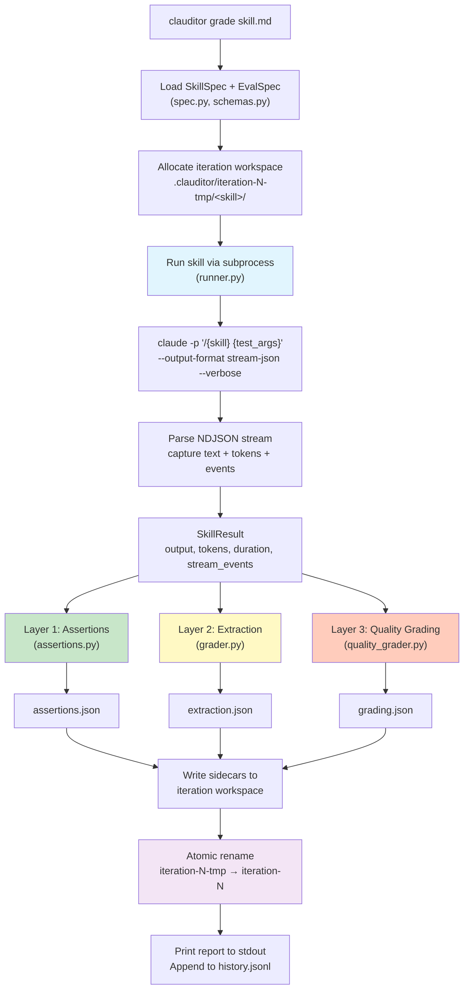
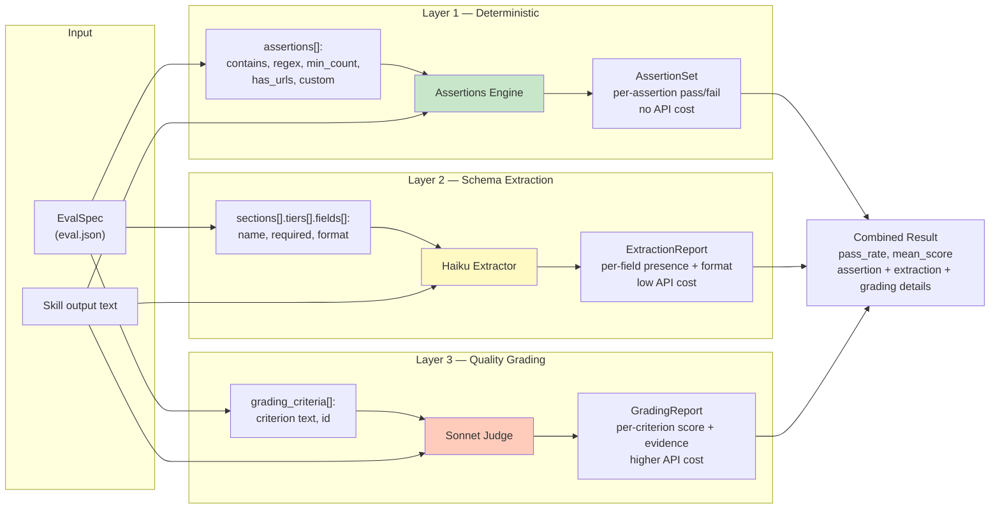

# Architecture Diagrams

## 1. Grade Command — End-to-End Flow

What happens when you run `clauditor grade skill.md`:

### Key details

| Step | What | Where |
|------|-------|-------|
| Subprocess | `claude -p` with stream-json output | `runner.py::SkillRunner._invoke` |
| L1 Assertions | Deterministic string matching — no API calls | `assertions.py::run_assertions` |
| L2 Extraction | Schema field extraction via Haiku | `grader.py::extract_and_report` |
| L3 Quality | Rubric-based grading via Sonnet | `quality_grader.py::grade_quality` |
| Persistence | Atomic workspace with sidecars | `workspace.py` + `cli.py` |
| History | One JSONL line per run for `clauditor trend` | `history.py::append_record` |

### Optional phases

- **`--variance N`**: Runs the skill N additional times, aggregates scores across all runs
- **`--baseline`**: Runs a second pass without the skill prefix, grades both, diffs via `compute_benchmark`
- **`--no-transcript`**: Skips writing `run-K/output.jsonl` stream captures

---

## 2. Three-Layer Evaluation Pipeline

How clauditor evaluates a skill's output through three independent layers:

### Layer comparison

| | Layer 1 | Layer 2 | Layer 3 |
|---|---------|---------|---------|
| **What** | Pattern matching | Schema extraction | Rubric grading |
| **How** | Regex, string ops | LLM (Haiku) | LLM (Sonnet) |
| **Cost** | Zero (no API) | Low (~$0.001/run) | Medium (~$0.01/run) |
| **Speed** | Instant | ~1-2s | ~3-5s |
| **Checks** | "Output contains X" | "Output has field Y in format Z" | "Output quality meets criterion C" |
| **Spec key** | `assertions[]` | `sections[].tiers[].fields[]` | `grading_criteria[]` |
| **Output** | `AssertionSet` | `ExtractionReport` | `GradingReport` |
| **Sidecar** | `assertions.json` | `extraction.json` | `grading.json` |

### When each layer runs

- **L1** always runs (if `assertions` defined in eval spec)
- **L2** only runs when `sections` are defined in the eval spec
- **L3** always runs (if `grading_criteria` defined — required for `grade`)
- All three layers receive the **same skill output text** and evaluate independently
- Results are combined into the final report; the overall pass/fail is driven by L3's `pass_rate` against the configured threshold (default 70%)
