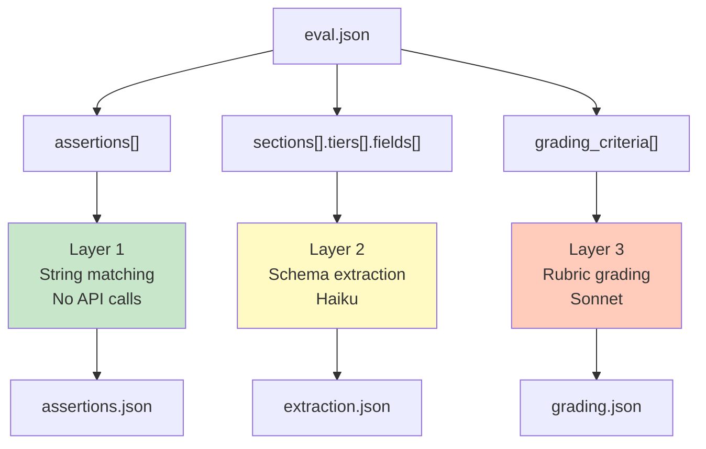

# Three Layers of Validation

The conceptual heart of clauditor: why it splits skill evaluation into three layers, what each layer costs, and when to use which one. Read this to understand the framework's design before authoring an eval spec or writing your first test. The layers are independent — use L1 alone on every PR, reach for L2/L3 when you need deeper signal.

> Returning from the [root README](../README.md). This doc is the full reference; the README has a summary with code examples.



## Layer 1: Deterministic Assertions (free, instant)

No API calls. Regex, string matching, and counting.

```python
from clauditor import SkillAsserter

asserter = SkillAsserter(result)
asserter.assert_contains("Venues")           # substring check
asserter.assert_not_contains("Error")        # absence check
asserter.assert_matches(r"\*\*\d+\.")        # regex
asserter.assert_has_entries(minimum=5)        # numbered entries
asserter.assert_has_urls(minimum=3)           # URL count
asserter.assert_min_length(500)              # output length
```

Or define in `eval.json`:

```json
{
  "assertions": [
    {"type": "contains", "value": "Venues"},
    {"type": "regex", "value": "\\*\\*\\d+\\."},
    {"type": "has_urls", "value": "3"},
    {"type": "not_contains", "value": "Error"}
  ]
}
```

## Layer 2: LLM Schema Extraction (cheap, ~1 sec)

Uses Haiku to extract structured fields, then validates against your schema. Requires `pip install clauditor[grader]`.

```python
import asyncio
from clauditor.grader import extract_and_grade
from clauditor.schemas import EvalSpec

spec = EvalSpec.from_file("my-skill.eval.json")
results = asyncio.run(extract_and_grade(output_text, spec))
assert results.passed, results.summary()
```

The eval spec defines what fields each section should have:

```json
{
  "sections": [
    {
      "name": "Venues",
      "min_entries": 3,
      "fields": [
        {"name": "name", "required": true},
        {"name": "address", "required": true},
        {"name": "hours", "required": true},
        {"name": "website", "required": true},
        {"name": "phone", "required": false}
      ]
    }
  ]
}
```

### Field validation (`format`)

Each field can declare a `format` that validates the extracted value. The `format` key accepts **either** a registered format name **or** an inline regex — clauditor looks up the string in `FORMAT_REGISTRY` first and falls back to compiling it as a regex if there's no match.

Decision tree:

- Is there a registered name in `FORMAT_REGISTRY` that fits? Use it (e.g. `"format": "phone_us"`).
- Need something custom? Put a regex string directly in `format` (e.g. `"format": "^[a-z0-9-]+$"`).
- Lookup is **registry-first, regex-fallback**. Invalid regexes raise `ValueError` at spec construction time, so typos fail fast.

```json
{"name": "phone", "format": "phone_us"}
```

```json
{"name": "slug", "format": "^[a-z0-9-]+$"}
```

See [`FORMAT_REGISTRY` in `src/clauditor/formats.py`](../src/clauditor/formats.py) for the full list of registered names (common entries: `phone_us`, `phone_intl`, `email`, `url`, `domain`, `date_iso`, `zip_us`, `uuid`).

## Layer 3: Quality Grading (expensive, release-only)

Uses Sonnet to grade skill output against a rubric you define. Requires `ANTHROPIC_API_KEY` and `pip install clauditor[grader]`.

### Quality Grading

Define rubric criteria in your eval spec:

```json
{
  "grading_criteria": [
    "Are all venues within the specified distance?",
    "Are events actually happening on the target date?",
    "Do cost tiers match the budget filter?"
  ],
  "grade_thresholds": {
    "min_pass_rate": 0.7,
    "min_mean_score": 0.5
  }
}
```

`grade_thresholds` controls when grading passes overall. `min_pass_rate` (default 0.7) is the fraction of criteria that must pass. `min_mean_score` (default 0.5) is the minimum average score across all criteria. Both must be met. This differs from `variance.min_stability`, which measures consistency across multiple runs rather than quality of a single run.

```bash
clauditor grade .claude/commands/my-skill.md
clauditor grade .claude/commands/my-skill.md --json
clauditor grade .claude/commands/my-skill.md --dry-run      # Print prompt, no API call
clauditor grade .claude/commands/my-skill.md --iteration 5  # Write to iteration-5/ explicitly
clauditor grade .claude/commands/my-skill.md --iteration 5 --force  # Overwrite existing iteration-5/
clauditor grade .claude/commands/my-skill.md --diff         # Compare against prior iteration
```

Every `grade` run is persisted to `.clauditor/iteration-N/<skill>/` automatically. By default the iteration number auto-increments to the next free slot. Pass `--iteration N` to target a specific slot; if `iteration-N/` already exists the command errors unless you also pass `--force` to overwrite.

Each criterion gets a pass/fail, score (0.0-1.0), evidence (quoted output), and reasoning. Use `--diff` to compare against a prior iteration (flags regressions where a criterion's score drops by more than 0.1).

### Iteration workspace layout

`.clauditor/` is anchored at the repository root (the nearest ancestor of your CWD containing `.git/` or `.claude/`), so `grade` from any subdirectory writes to the same place. Each run produces:

```
.clauditor/
  iteration-1/
    my-skill/
      grading.json        # full GradingReport
      timing.json         # skill name, iteration, n_runs, token + duration metrics
      run-0/
        output.txt        # rendered text blocks
        output.jsonl      # raw stream-json events
  iteration-2/
    my-skill/
      grading.json
      timing.json
      run-0/
        output.txt
        output.jsonl
      run-1/              # additional runs appear under --variance N
        output.txt
        output.jsonl
  history.jsonl
```

### Regression Comparison

Diffs two grade reports, printing `[REGRESSION]` for pass→fail flips and `[IMPROVEMENT]` for fail→pass. Exits 1 on any regression. `compare` accepts three input forms:

```bash
# 1. Numeric iteration refs (preferred — pairs with auto-incremented iterations)
clauditor compare --skill my-skill --from 1 --to 2

# 2. Iteration directory paths
clauditor compare .clauditor/iteration-1/my-skill .clauditor/iteration-2/my-skill

# 3. Saved grade-report files
clauditor compare before.grade.json after.grade.json

# Or re-grade two raw captures against a spec:
clauditor compare before.txt after.txt --spec <skill.md>
```

For a true baseline A/B run (skill vs raw Claude against the same rubric), use the Python API `clauditor.comparator.compare_ab()` directly — the `grade --compare` CLI flag was removed in favor of the file-diff workflow above.

#### Blind A/B comparison (`--blind`)

Rubric-based grading can miss holistic regressions where two outputs pass every criterion but one visibly feels worse. For that, pass `--blind` to have a Sonnet judge compare the two outputs side-by-side without knowing which version is which:

```bash
clauditor compare before.txt after.txt --spec <skill.md> --blind
```

The judge runs twice with the A/B positions swapped so position bias shows up as disagreement. Output includes a preference (`BEFORE` / `AFTER` / `TIE`), confidence, per-output holistic score, whether the two runs agreed on the winner, and the judge's reasoning. Currently only the file-pair form is supported (iteration refs like `--from/--to` are rejected); `--blind` requires `--spec` with `eval_spec.user_prompt` set (the natural-language query the judge will see) and uses `grading_criteria` from the spec as an optional rubric hint to the judge.

### Variance Measurement

Runs the skill N times and measures output stability across runs:

```bash
clauditor grade .claude/commands/my-skill.md --variance 5
```

Configure thresholds in the eval spec:

```json
{
  "variance": {
    "n_runs": 5,
    "min_stability": 0.8
  }
}
```

Reports `score_mean`, `score_stddev`, `pass_rate_mean`, and `stability` (fraction of runs where all criteria passed). Fails if stability drops below `min_stability`.

### Trigger Precision Testing

Tests whether an LLM correctly identifies which user queries should invoke your skill:

```bash
clauditor triggers .claude/commands/my-skill.md
clauditor triggers .claude/commands/my-skill.md --json
```

Define test queries in the eval spec:

```json
{
  "trigger_tests": {
    "should_trigger": [
      "Find kid activities in Cupertino",
      "What are some things to do with kids near me?"
    ],
    "should_not_trigger": [
      "What's the weather today?",
      "Help me write a Python script"
    ]
  }
}
```

Reports accuracy, precision, and recall. Passes only when every classification is correct.

### Python API

```python
import asyncio
from clauditor.quality_grader import grade_quality, measure_variance
from clauditor.comparator import compare_ab
from clauditor.triggers import test_triggers
from clauditor.spec import SkillSpec

spec = SkillSpec.from_file(".claude/commands/my-skill.md")

# Quality grading
report = asyncio.run(grade_quality(output, spec.eval_spec))
print(f"{report.pass_rate:.0%} passed, mean score {report.mean_score:.2f}")

# A/B comparison
ab = asyncio.run(compare_ab(spec))
print(f"Regressions: {len(ab.regressions)}")

# Variance
var = asyncio.run(measure_variance(spec, n_runs=3))
print(f"Stability: {var.stability:.0%}")

# Trigger precision
triggers = asyncio.run(test_triggers(spec.eval_spec))
print(f"Accuracy: {triggers.accuracy:.0%}, Precision: {triggers.precision:.0%}")
```
